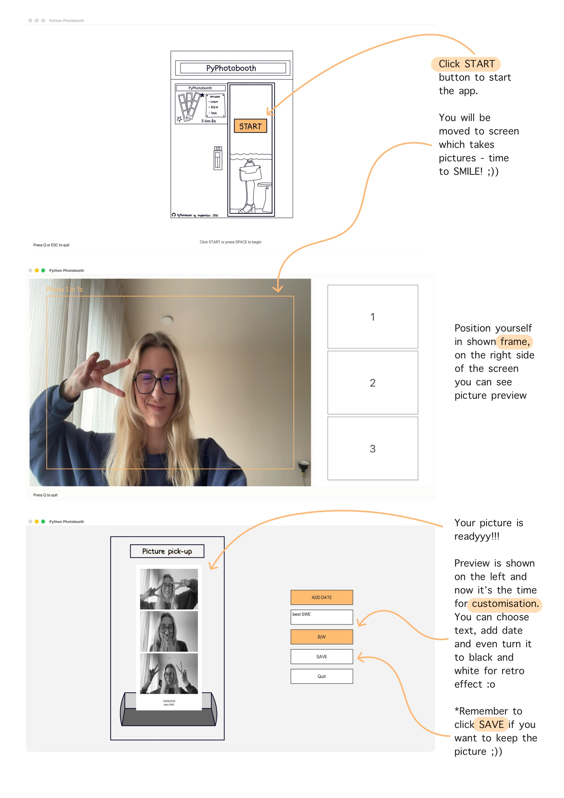

# Python Photobooth



Opens your camera, counts down, takes 3 photos, and builds a vertical photo strip with an optional footer. The left 70 % of the window shows the live camera feed with a framing rectangle; the right 30 % shows the strip panel.

## Install

```bash
python3 -m pip install -r requirements.txt
```

## Shooting phase

- A gold frame rectangle shows the crop area for each photo.
- The right strip panel fills in with each captured photo.
- Press **Q** at any time to quit.

## Review phase (after all 3 photos are taken)

The camera turns off and the full window switches to a review layout:

- **Left side** — preview of the photo strip including any applied effects and footer text.
- **Right side** — controls (all the same width and height for visual consistency):

| Control | Action |
|---|---|
| **ADD DATE** | Toggles the current date in the strip footer. Highlights in gold when active. |
| **ADD TEXT** field | Click to focus, then type a custom message. Text wraps to a new line if it exceeds the box width. Press **Enter** or **Esc** to unfocus. Keyboard shortcuts are disabled while the field is focused. |
| **B/W** | Converts the strip to greyscale. Highlights in gold when active. |
| **SAVE** | Saves the strip as a JPEG to the output folder. A bold green confirmation appears 50 px below the Quit button. |
| **Quit** | Closes the application. |

Keyboard shortcuts (when the text field is not focused): **D** = toggle date, **B** = toggle B/W, **S** = save, **Q** = quit.

## Photo strip

- Width matches the photo width exactly (no side padding).
- Always includes a footer area at the bottom.
- If date is enabled, it appears first in the footer; the custom message appears below it.
- Both date and custom text wrap automatically if they exceed the strip width.
- All footer text is centred and uses the same font size.
- B/W conversion is applied last, so it also affects footer text.

## Output

Saved strips are written to:

```
/Users/.../PyDeveloper/photobooth_pictures/
```

The path can be changed on the `self.output_dir` line in `__init__`.

## Fonts & colours

- All text uses **San Francisco** (`/System/Library/Fonts/SFNS.ttf`).
- Background: `RGB(252, 252, 250)` — near-white cream.
- Accent (frame, active buttons, text-box focus border): warm gold `RGB(255, 188, 112)`.

## Future development

- Turning it into a web app.
- If you have other ideas, let me know and we can do it.
